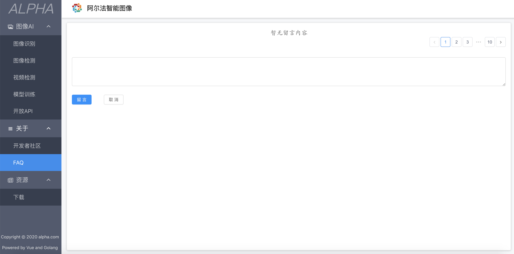

# Alpha智能图像
## _Image Detection And Image Recognition Tools_

**首页展示**  
  

### 项目介绍  
alpha智能图像项目是全栈项目，主要对图片的识别，探测，相似度对比，留言交流，以及视频检测的工具平台。前端vue.js+vueX,后端golang+gin,以及模型训练python脚本。  

项目分3个部分:
- alpha-ui  
 前端部分，提供图像探测，图像检测，视频检测，模型训练以及开放API,提供图片的上传。  
- alpha-core  
 使用gin作为http服务框架，提供resetful服务。 
 启动成功后展示所有相关API：  
   
- alpha-script  
  以python作为数据执行脚本。通过训练的模型数据，检测图片。参考[ImageAI](https://imageai-cn.readthedocs.io/zh_CN/latest/)  

### 安装部署
- 环境准备  
 安装mongodb并配置alpha-core
 启动nginx作为静态图片服务器  

### 功能特性  
- 图像识别

- 图像检测

当上传图片后，后端需要一定的时间进行分析，最后结果呈现如下：  

- 留言板功能

